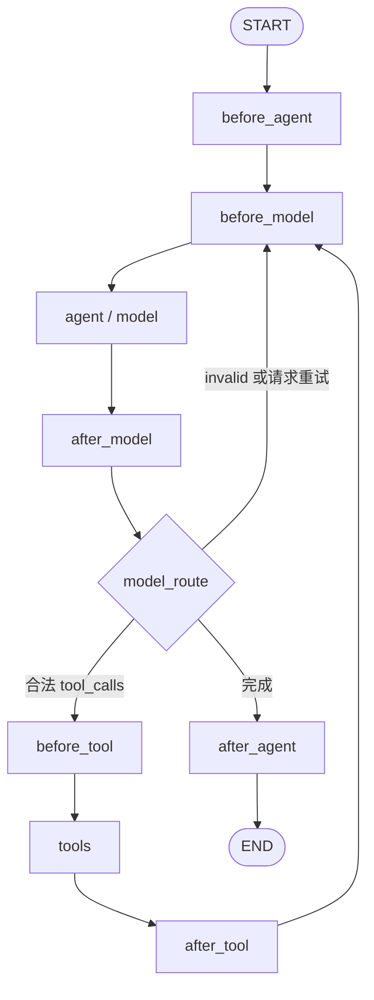

# 设计：core + plugin hook

日期：2026-09-10  
状态：首版已实现（2026-09-10）；实施差异和验证记录见第 14 节；二次修订（移除节点注入、plugin 包上移）见第 15 节

## 1. 目标与关键决策

在现有 `AgentLoop` 上增加 plugin 机制：plugin 用 node hook 参与生命周期，用 wrap hook 拦截单次模型或工具调用；注册表负责依赖与顺序，AgentLoop 负责构建固定主图、编译 hook graph 和发布新版本。

采用以下设计：

1. 主图始终保留六个 hook 调度节点，以及现有 `agent`、`tools` 节点。无插件时 hook 节点返回空增量。
2. 六个 node hook 各自编译一张内部 graph，通过普通函数调用；wrap hook 编译成调用链，不作为 graph 节点。
3. 内部 hook graph 使用 `compile(checkpointer=False)`，每次从主图状态重新开始，不持有跨调用 checkpoint。插件更新只替换受影响的内部 graph/调用链。
4. 一轮执行固定一个不可变的插件快照。更新对新一轮生效；正在运行、重试或等待审批的轮次继续使用原版本。
5. 审批由 hook 返回结构化暂停请求，固定主图节点调用 `interrupt()`。内部 hook 不直接调用 `interrupt()`。
6. 保留 `agent → core → ai` 分层，以及 AgentLoop 不持有 LLM/工具、invoke/stream 同形透传的契约。插件快照绑定和恢复检查由 agent 层完成，core 提供显式辅助接口。
7. 创建新 AgentLoop 时自动生成只读 `agent_id`；插件注册、依赖、快照和版本发布均按 agent_id 隔离，为后续多 agent 编排预留身份边界。

本文中的“plugin”是本项目运行时扩展对象，不涉及 Codex 插件、pip 自动安装或第三方代码沙箱。

## 2. 相对原草案的修正

### 2.1 名称

公开 API 统一使用 `wrap`，修正草案中的 `warp`；统一使用 `agent`，修正 `agnet`。这是新接口，不引入拼写错误别名。

`model_node` 是逻辑称呼，主图物理名称继续为 `agent`；`tool_node` 的物理名称继续为 `tools`。这样能减少现有 checkpoint、事件过滤和测试的迁移成本。

### 2.2 工具回路

草案同时包含 `tools → after_tool → tools` 和 `tools → before_model`。这会重复调用工具，并可能形成并行分支，而不是顺序执行。

改为唯一顺序：

```text
before_tool → tools → after_tool → before_model
```

### 2.3 checkpoint 兼容性的范围

函数包装是主图结构稳定的手段，但不会自动隔离内部 graph 的持久化。LangGraph 支持在普通节点函数中调用内部 graph，该调用仍可能具有子图持久化语义；本方案显式关闭内部 checkpoint。[官方说明](https://docs.langchain.com/oss/python/langgraph/use-subgraphs)

因此，“更新时清理 hook graph 的 checkpoint”落实为：内部 graph 从一开始就不写持久 checkpoint，无需删除；每次调用的临时 state 在调用结束后释放。绝不能按 `thread_id` 清库，这会删除主图对话历史和审批信息。

固定节点名也不意味着所有升级均兼容。state schema、消息语义、插件代码版本和暂停恢复协议仍需要兼容；首次从现有两节点图迁到本方案，应单独处理尚未完成的旧线程。[图迁移说明](https://docs.langchain.com/oss/python/langgraph/graph-api#graph-migrations)

## 3. 主图结构与生命周期



对应的主图连线：

```python
builder.add_edge(START, "before_agent")
builder.add_edge("before_agent", "before_model")
builder.add_edge("before_model", "agent")
builder.add_edge("agent", "after_model")
builder.add_conditional_edges(
    "after_model",
    model_route,
    {
        "tools": "before_tool",
        "retry": "before_model",
        "end": "after_agent",
    },
)
builder.add_edge("before_tool", "tools")
builder.add_edge("tools", "after_tool")
builder.add_edge("after_tool", "before_model")
builder.add_edge("after_agent", END)
```

| 生命周期 | 次数与含义 |
| --- | --- |
| before_agent | 每个新用户轮次进入一次；不等于进程启动或每次模型调用 |
| after_agent | 本轮正常完成时进入一次；不是异常或取消后的 finally |
| before_model / after_model | 每次模型节点执行前后，包括格式错误后的模型重试 |
| before_tool / after_tool | 每批 tool calls 的工具节点前后；批内单个工具由 wrap_tool_hook 拦截 |

“进入一次”描述正常路径；失败重放、审批恢复可能重新执行同一节点。异常监控和资源释放放在编排层的异常处理及插件自身 `try/finally`，不保证 `after_agent` 在故障时执行。

`model_route` 只允许三个目标。默认沿用现有 `should_continue` 判定：最近 AIMessage 有合法调用则去 tools，只有 invalid 则 retry，其余 end。`after_model` 可返回受限的 `route="retry" | "end"`；存在尚未闭合的 tool calls 时拒绝强制 retry/end，插件需先修正对应 AIMessage 和反馈消息。普通 hook 不允许返回任意 `Command(goto=...)`。

## 4. hook API

### 4.1 hook 名称及同步/异步选择

| 类型 | 同步方法 | 异步方法 |
| --- | --- | --- |
| node_hook | before_agent | abefore_agent |
| node_hook | after_agent | aafter_agent |
| node_hook | before_model | abefore_model |
| node_hook | after_model | aafter_model |
| node_hook | before_tool | abefore_tool |
| node_hook | after_tool | aafter_tool |
| wrap_hook | wrap_tool_hook | awrap_tool_hook |
| wrap_hook | wrap_model_hook | awrap_model_hook |

注册表以八个不带 `a` 的逻辑名称建立槽位。node hook 的同步/异步方法组成同一个逻辑 hook，以一个 `RunnableCallable(func, afunc)` 对象加入内部 hook graph，不拆成两个节点，也不在注册时只保留异步方法。

例如 `hooks=["before_model"]` 收集该插件实际实现的 `before_model` 与 `abefore_model`，分别绑定 func/afunc。`hooks=["abefore_model"]` 是同一逻辑槽位的别名，要求异步方法确已实现，但仍保留已实现的同步方法；同时列出这两个名称时归并为一个节点，不执行两遍。重复列出完全相同的名称仍报错。wrap hook 保持调用链协议，异步执行优先使用对应 `a...` 实现，不直接作为 graph 节点。

| 插件实现 | invoke | ainvoke / astream |
| --- | --- | --- |
| 同步 + 异步 | 同步实现 | 异步实现 |
| 仅同步 | 同步实现 | 框架提供的线程执行异步适配器调用同步实现 |
| 仅异步 | 明确报错，不隐式启动事件循环 | 异步实现 |

一次节点执行只选一个实现，不依次执行同步和异步两份逻辑。主图是否整体支持同步运行仍由其全部节点和 checkpointer 决定。

基类占位方法不算实现；错误名称、未实现方法、错误签名均在注册时失败。当前 AgentLoop 只提供异步运行，同步 hook 是插件编写方式，不新增 `graph.invoke()` 同步外观。

### 4.2 基础协议

以下是拟定接口轮廓，省略 imports 和部分数据类型定义：

```python
class PluginBase:
    name: str
    version: str = "1"
    parent_plugins: tuple[str, ...] = ()

    def before_model(self, state: AgentState, runtime: HookRuntime) -> HookResult | None:
        """返回状态增量；默认未实现。"""
        raise NotImplementedError

    async def awrap_model_hook(
        self, request: ModelRequest, handler: AsyncModelHandler
    ) -> ModelResponse:
        """修改模型请求或响应，也可以直接返回缓存结果。"""
        raise NotImplementedError

    async def awrap_tool_hook(
        self, request: ToolCallRequest, handler: AsyncToolHandler
    ) -> ToolMessage | Command:
        """包裹单个工具执行，保持 tool_call_id 不变。"""
        raise NotImplementedError
```

其余 node hook 使用同一 `(state, runtime) -> HookResult | None` 签名；异步版本返回对应 awaitable。`PluginBase` 暴露所有声明方法，但不要求插件实现全部方法；注册是显式 opt-in。

| 类型 | 字段/职责 |
| --- | --- |
| HookRuntime | 只读 `agent_id`、`context`、`config`、`hook_name`、`plugin_name`、`revision`、`run_id`、本节点审批答案；不直接提供 checkpoint 写入能力 |
| HookResult | `update: AgentStateUpdate`、可选 `pause: HookPause`、可选受限 `route`；pause 时不可同时提交 update/route |
| HookPause | `key`、可序列化 payload、答案校验约束；key 在插件和节点调用内稳定 |
| AgentStateUpdate | 允许 `messages` 增量及插件自己的 `plugin_state` 命名空间；禁止修改 run/version 标识和原始输入 |
| ModelRequest | 当前 llm、tools、发送 messages、调用 config、运行上下文；用 `override(...)` 创建修改副本 |
| ModelResponse | 规范化的普通 `AIMessage`，或空结果；不返回未经校验的 AIMessageChunk |

`HookRuntime` 是显式传给插件的项目协议，不依赖 LangGraph 按 `runtime` 以外的参数名注入。框架的固定节点仍使用 `(state, config, runtime: Runtime[AgentContext])`。

仅实现同步 node hook 时，框架为 RunnableCallable 显式补一个在线程中执行同步适配器的 afunc，避免阻塞事件循环。本地版本的 `RunnableCallable.ainvoke()` 在缺少 afunc 时直接调用 `invoke()`，不会自动切换线程；不能把线程 fallback 误认为是 RunnableCallable 自带的行为。

同步 wrap hook 也在线程中运行，其同步 `handler` 将异步下一层投递回原事件循环并等待结果；绝不能在主事件循环线程上调用阻塞 `Future.result()`。桥接必须传递 contextvars/config、异常和取消信号，并限制嵌套同步桥接的线程资源。异步插件优先用 `a...`，减少线程开销。node hook 的双函数包装不替代 wrap hook 的 handler 桥接。

## 5. 注册、依赖与执行顺序

### 5.1 agent 身份与按 agent 注册

```python
registry = PluginRegistry()
loop = AgentLoop(checkpointer=checkpointer)  # 构造时自动生成 agent_id，插件集初始为空
registry.register(
    AuditPlugin(),
    agent_id=loop.agent_id,
    hooks=["before_agent", "after_agent"],
)
registry.register(
    ApprovalPlugin(),
    agent_id=loop.agent_id,
    hooks=["before_tool", "awrap_tool_hook"],
)
loop.update_plugin_hooks(registry.snapshot(agent_id=loop.agent_id))
```

新建 AgentLoop 时由构造器执行 `self._agent_id = uuid4().hex`，通过只读属性 `loop.agent_id` 暴露；即使没有插件也必须生成。不能在每次 invoke/stream 时重新生成，模型名、thread_id 或插件名也不能代替 agent_id。

由于注册需要 loop 生成的 agent_id，初始化顺序改为“创建空插件 loop → 按 agent_id 注册 → 首轮执行前发布快照”，替代原先先注册再将快照传入构造器的 `plugin_hook=` 用法。空插件 loop 在构造时已编译固定主图，首次发布只编译内部 hook graph，不再次编译主图。agent 装配层在完成首次发布后才把 session 放入缓存或提供给请求使用。

注册表使用实例，可由多个 agent 共享；内部索引为 `agent_id → plugin_name → registration`。不可变 `PluginSpecSnapshot` 包含 agent_id、插件对象及选中的方法、依赖、版本、注册序号，发布时编译为携带相同 agent_id 的 `CompiledPluginBundle`。后续 registry 的修改不会隐式改变任何 loop。

| 标识 | 范围与生命周期 |
| --- | --- |
| agent_id | 一个逻辑 agent 的身份，新建 loop 时生成，跨其全部会话和插件更新保持不变 |
| thread_id | 对外会话标识，一个 agent 可有多个 thread；不同 agent 可使用相同 thread_id |
| run_id | 一轮执行，重试与审批恢复保持不变，新轮次重新生成 |
| plugin_revision | agent 内某一插件快照的版本，与 agent_id 一起定位运行定义 |

服务重启恢复已有 agent 与新建 agent 必须区分：新建总是生成新 id；恢复通过单独的 `AgentLoop.restore(agent_id=..., ...)` 工厂读取受信任的持久 agent 定义，内部复用原 id，不给普通构造器开放任意指定 id。装配层持久保存 agent_id 到配置/恢复定义的映射，不能依靠进程内缓存保存身份。restore 是恢复既有身份，不是创建第二个独立 agent；同一身份的并发所有权由编排层管理。

注册规则：

- `agent_id` 是 register 的必填关键字参数，缺失或空值失败，没有隐式默认 agent 或通配 agent。
- `name` 在同一 agent_id 内必须唯一且稳定；不同 agent 可注册同名插件，拥有独立配置和注册顺序。不能使用随机 UUID 作为同一插件的持久身份。
- `parent_plugins` 必须已在同一 agent_id 内注册；另一个 agent 的同名父插件不能满足依赖。缺少依赖、自依赖或形成环时失败，不自动安装依赖。
- 插件配置和依赖在注册时复制/冻结；更新使用新实例和新版本，禁止原地修改运行中的对象。
- `hooks=[]` 可用于仅提供依赖身份的插件；该插件不产生任何执行节点。
- 变更是事务性的，失败不留下部分注册结果。错误信息包含插件名、hook 名及缺失依赖/环路径。

### 5.2 排序

先对指定 agent_id 下的所有插件按依赖做稳定拓扑排序，多个可选节点按该 agent 内的注册序号选取；之后按 hook 槽位筛选。先在 agent 范围内完整排序再筛选，才能保留未实现该 hook 的中间依赖产生的传递关系；不同 agent 的注册顺序互不影响。

例如 A → B → C，其中只有 A、C 实现 before_model，则该 hook graph 为 `START → A → C → END`。

本期所有 node hook（包含 after_*）均正序执行，与“按注册顺序和依赖组成 graph”保持一致。依赖关系表达执行先后，不自动表达资源栈的释放顺序。插件之间可能写同一 messages 字段，因此不并行执行 node hook。

wrap hook 使用同一排序构建洋葱调用链：

```text
A.request → B.request → terminal → B.response → A.response
```

A 是 B 的父依赖时，A 在外层；response 阶段天然逆序。工具节点原有的批内并发保持，各工具拥有独立 request，插件实例不得用共享可变属性存放本次请求数据。

### 5.3 管理 API

```python
registry.register(plugin, *, agent_id, hooks) -> None
registry.replace(name, plugin, *, agent_id, hooks) -> None
registry.unregister(name, *, agent_id) -> None
registry.snapshot(*, agent_id) -> PluginSpecSnapshot

loop.agent_id -> str
loop.update_plugin_hooks(snapshot, *, expected_revision=None) -> PluginUpdateResult
loop.plugin_revision -> str
loop.describe_plugin_hooks(revision=None) -> PluginDescription
loop.bind_plugin_context(context, *, revision=None) -> AgentContext
```

`unregister` 在目标 agent 内遇到依赖者时失败，调用方按反向依赖顺序显式删除。`replace` 保留该 agent 内的注册序号、名称必须相同，重新检查其全部依赖和签名。修改 registry 是准备动作，调用 `update_plugin_hooks` 才发布到目标 loop；不影响其他 agent。多个 agent 使用同一插件类时默认创建独立实例，避免实例属性串扰。

`PluginUpdateResult` 返回 agent_id、旧/新 revision、重编译的槽位及新轮次生效说明。`describe` 提供 agent_id、每个槽位的插件顺序、绑定的 sync/async 方法及版本，并区分插件原生异步实现与框架生成的线程 fallback，便于排查。

## 6. hook graph 的 state 与执行器

### 6.1 主 state 的固定扩展

保持 `messages/system/raw_input/summary`，增加可选字段：

```python
agent_id: NotRequired[str]
plugin_revision: NotRequired[str]
run_id: NotRequired[str]
plugin_state: NotRequired[dict[str, dict[str, JsonValue]]]
model_route_override: NotRequired[Literal["retry", "end"] | None]
```

主图不会因为单个插件增加 TypedDict 字段。`plugin_state[plugin_name]` 是该插件完整的可序列化命名空间值，跨插件按 namespace 合并，同插件本次值替换旧值。卸载后历史 namespace 默认保留，再安装同名插件需做版本校验或显式迁移。

`model_route_override` 只能由 after_model dispatcher 根据合法 HookResult.route 写入，其他 hook 返回 route 时失败。before_model dispatcher 每次清空它，防止上一次循环的路由污染下一次；无插件快路径也执行该清理。插件不能通过普通 update 直接写入此字段。

本轮审批/参数调整等短期数据必须携带 `run_id`；新一轮初始化时由所属插件清理或忽略旧轮数据。LLM、工具、函数、锁和 bundle 不进 checkpoint。

### 6.2 内部 state 使用独立 envelope

不直接把主 `AgentState` 当成内部 graph 的输出 schema，避免把完整历史再次送入 `add_messages`。

```text
HookGraphState
  working_state   当前主 state 的隔离副本，整值替换
  patches         按执行顺序追加的合法增量列表
  pause           可选暂停请求
  route           可选路由建议
```

每个插件节点执行以下流程：读取工作副本 → 调用 hook → 校验字段/消息/namespace → 将增量按主图相同 reducer 应用到工作副本 → 记录增量 → 执行下一个插件。遇到 pause 或合法 route 则结束本次内部 graph；同一槽位内首个控制结果生效，后续插件不执行。

结束后 dispatcher 仅返回归并后的 patch，不返回完整 `working_state`：

- messages 保留按序的新增、同 id 替换、RemoveMessage 操作；新消息在首次应用前就分配 id，内外使用相同 id。
- 普通字段按允许的覆盖规则合并；plugin_state 按 namespace 合并。
- 对已抵消的新增/删除操作做规范化，使内部工作状态与外层 reducer 应用结果相同。
- 用测试覆盖 `新增 → 修改 → 删除`、旧消息替换、同 id 多次修改及空增量；不把 `add_messages` 当成简单列表相加。

主状态和 message 对象不可被原地修改。仅复制外层 dict 不够，插件获得的可变 message/嵌套参数也要隔离，返回结果才是唯一提交路径。

### 6.3 编译与 config

每个非空槽位构建线性 `StateGraph(HookGraphState)`，以插件稳定名称作为内部节点名，暂停/route 用条件边退出；空槽位使用返回 `{}` 的 dispatcher 快路径。

每个插件对应一个 RunnableCallable 节点。参考本地 `langchain/agents/factory.py` 对 before_model/abefore_model 的处理，先排除基类未实现的占位方法，再将两种实现绑定到同一个对象：

```python
from langgraph._internal._runnable import RunnableCallable

# 两个适配器均接收 (state, config, runtime)，仅内部调用方式不同。
# 适配器负责 HookGraphState → 插件输入，以及 HookResult → envelope 增量。
sync_node = build_sync_node_adapter(sync_hook) if sync_hook else None
async_node = build_async_node_adapter(async_hook) if async_hook else None
if async_node is None and sync_node is not None:
    async_node = build_executor_fallback(sync_node)

node = RunnableCallable(sync_node, async_node, trace=False)
builder.add_node(f"{plugin.name}.before_model", node)
```

上述 build_* 为本项目待实现的适配器，不是 LangGraph API。sync/async 适配器必须保持相同的参数名和类型注解：本地 RunnableCallable 从 `func or afunc` 的签名提取注入参数，不能让两种实现依赖不一致的注入约定。适配器接收 LangGraph Runtime 后显式构造 HookRuntime，不能直接把插件期望的 HookRuntime 当成框架注入的 Runtime。

所有六组 node hook 采用同一构建流程。RunnableCallable 位于 LangGraph 的 `_internal` 模块，将该 import 集中在 `core/plugin/graph.py`，以锁定版本的行为测试约束后续依赖升级。

内部 graph 显式 `compile(checkpointer=False)`，调用时显式传入 context/config。保留 callbacks、trace 等运行信息，不伪造或随意删除 LangGraph 的私有配置字段。内部递归上限按 hook 数量单独设置，例如节点数量 + 固定余量，避免误用主图 25 步上限。

固定 dispatcher 只捕获 hook 名称，不捕获“当前最新版 graph”；每次从本轮 `context.plugin_bundle` 选择对应内部 graph。发布新版本不会改变已运行线程看到的对象。

## 7. wrap hook：模型与工具

### 7.1 模型调用链

现有默认模型节点实际调用 `model.astream(...)`，不是单次 `model.invoke()`。新的模型 terminal 保留流式能力，wrap_model_hook 包裹一次完整逻辑调用：

```text
构造 system/summary/截断后的发送视图
  → ModelRequest
  → wrap_model 链修改 request
  → 使用最终 request.llm.bind_tools(request.tools)
  → astream(messages, config=config)
  → chunk 合并及严格 JSON 解析
  → ModelResponse
  → wrap_model 链修改 response
  → 统一校验及 invalid id/反馈规范化
  → 写入主 state
```

模型 plugin 可换模型、改 prompt/messages、限制本次 tools、命中缓存或改响应。动态 prompt 优先修改 `ModelRequest.messages`，避免每轮向 checkpoint 反复添加同一 SystemMessage；node hook 适合需要持久化的消息更改。

请求 tools 本期只能来自本轮 context.tools，模型侧可缩小集合；新增或替换工具需在下一轮装配 context 时完成，避免模型生成 tools 节点不能执行的调用。

保留当前三条保证：`astream` 传 config；普通 AIMessage 写 checkpoint；invalid tool call 的严格解析及确定性 id 与 repair 共用规范化函数。wrapper 产生的响应也经过该规范化入口，包括 mixed valid/invalid 的完整反馈策略，不能只校验 terminal 原始响应。

`handler` 默认只调用一次。缓存可零次调用；多次调用用于显式重试且受预算限制。工具重试还要求业务幂等，框架不自动重放有副作用工具。

### 7.2 流式与最终响应修改

已发出的 token 无法撤回。`wrap_model` 在完整响应返回后改写 content，可能导致 token 与最终文本不同。

首版明确采用以下协议：token 是暂定输出；`done.final_text` 来自全部 after_* 执行完成后的 checkpoint，是权威结果。客户端完成时用 final_text 校准展示。缓存命中可能没有 token，但必须有完整最终结果。

若插件要求“任何未审核文本都不能外发”，需声明 `requires_buffered_output=True`，在 session 事件转发层缓冲该轮 thinking/llm token，审核通过后发送最终文本；不能只在模型 terminal 内缓存 chunk，因为 callbacks 已可产生流式消息。审批失败不得释放缓冲内容。

hook 内部额外调用模型可能继承 callbacks。框架为主模型 terminal 设置明确调用角色/标记，事件分类只接受主模型流，内部辅助模型 token 不外发；不能只依赖 `langgraph_node == "agent"`。

### 7.3 工具调用链

复用当前依赖的 `ToolCallRequest.override()` 和 `AsyncToolCallWrapper` 协议：

```python
tool_node = ToolNode(
    context.tools,
    handle_tool_errors=True,
    awrap_tool_call=composed_async_tool_wrapper,
)
```

本地 `langgraph-prebuilt==1.1.0` 已提供 `awrap_tool_call`。其同步 wrapper 在异步模式下会使用同步执行 fallback，不能覆盖仅支持异步的工具；因此组合后的插件链统一走 async 入口，同步插件由本项目桥接。

调用顺序为：审批决定的强制执行检查 → 插件 wrapper A → B → 现有 `context.wrap_tool_call`（如有）→ ToolNode terminal。原有同步拦截器也经桥接接到异步 terminal，保持相对终端最近的兼容位置。

wrapper 可修改参数及结果，短路返回缓存或拒绝 ToolMessage；`tool_call_id` 必须保持对应原请求。改变工具名称必须同步解析匹配的 tool 实例，并限制在 context.tools 范围内。

工具返回 `Command` 时仅接受无跳转、更新允许字段且有正确 ToolMessage 的形式；拒绝 `goto`、`Command.PARENT` 和越权字段。校验放在 ToolNode 返回主图状态的边界，避免验证异常被 `handle_tool_errors=True` 静默转换后继续执行。

工具业务异常沿用错误 ToolMessage 语义；node hook/模型 wrapper 的编程错误直接失败，不作为瞬时异常重试。工具 wrapper 内部异常受 ToolNode 当前错误处理约定约束，应记录 plugin/hook 身份；框架契约错误在节点出口再次验证。取消和 LangGraph 控制异常必须保留原语义。

审批拒绝记录在带 run_id 的状态中，由链外的强制检查直接生成 `status="error"` 的 ToolMessage，不进入插件 wrapper 和真实工具。审批编辑后的参数也进入该检查；批准绑定工具名及参数指纹，下游 wrapper 若再次改变执行目标或参数则失败，需重新审批。这样在 before_tool 阶段暂停即可覆盖批内并发工具，不依赖工具内部 interrupt。

审批插件在 before_tool 中将编辑后的参数以相同消息 id 更新对应 AIMessage，保证历史及后续事件记录实际批准的调用。真实工具 terminal 前再次校验批准指纹，防止经过 wrapper 后参数发生变化；结果出口也校验 id。审批是已注册插件共同遵守的协议，不构成对恶意 Python 插件直接访问外部服务的安全隔离。

## 8. 动态更新、版本绑定与兼容性

### 8.1 更新事务

`update_plugin_hooks` 依次完成：

1. 首先校验 `snapshot.agent_id == loop.agent_id`，不匹配则返回 `PluginAgentMismatch`；再校验候选快照、依赖、hook 签名和配置。
2. 对比槽位指纹：插件名/版本/配置、具体方法、排序；依赖变化引起的顺序变化也算改变。
3. 只编译变化的 node hook graph 和 wrap 链；其他对象复用。
4. 编译全部成功后，在短锁内校验 `expected_revision`，一次性发布整个 bundle。
5. 返回更新结果；任一步失败都保留原 bundle。

主图对象、节点集合、边集合及主 checkpointer 对象均不替换，agent_id 也不变化。revision 是可持久识别的 manifest 指纹，不能仅用进程内自增数字；同一插件版本不得悄悄替换代码/配置。bundle 的查找、缓存、CAS 和历史版本保留均以 `(agent_id, revision)` 定位，不能仅凭 revision 从另一个 agent 借用 bundle。

不可变快照冻结的是定义和配置，不会让任意 Python 对象自动线程安全。插件必须保持配置不可变，将会话状态存入 plugin_state 或外部按 run/thread 隔离的存储。

### 8.2 保持 AgentLoop 的同形透传

`invoke/stream` 不隐式改 input 或 context。增加显式 helper `bind_plugin_context`，将指定 bundle 放入一个新的 context 副本，不修改 `get_deps` 缓存中的共享 context。

新一轮的 ChatSession 流程：按 `(agent_id, thread_id)` 检查是否有 pending/interrupt → repair → compress → 绑定当前 agent 的 bundle → 创建 run_id → 将 agent_id/run_id/plugin_revision 连同本轮 HumanMessage 放入 initial state → 调用 loop。

初始输入的身份和版本标识由主图 input checkpoint 持久化，早于第一个 hook 执行，因此 before_agent 暂停也能知道恢复版本。`bind_plugin_context` 在 context 副本中绑定 agent_id/bundle，并拒绝已绑定到其他 agent 的 context。所有固定节点检查 state/context/bundle 的身份和版本与所属 loop 一致；未绑定的非空插件调用明确失败。无插件旧 core 用法仍可省略插件字段，loop 本身始终拥有 agent_id；session 统一使用完整身份约定。

直接驱动 core 的调用方同样显式准备输入：

```python
context = loop.bind_plugin_context(AgentContext(llm=llm, tools=tools))
initial = {
    "agent_id": loop.agent_id,
    "messages": [HumanMessage(content="查询今天的任务")],
    "raw_input": "查询今天的任务",
    "run_id": uuid4().hex,
    "plugin_revision": context.plugin_bundle.revision,
}
result = await loop.invoke(initial, config, context=context)
```

直接调用 `loop.graph.ainvoke/astream` 遵守同一输入约定；图外旁路调用不会自动获得 session 的并发锁、版本恢复和结果塑形能力。

共享 checkpointer 时，agent_id 只放在 state 中不足以隔离历史：checkpoint 在读取 state 前就按 config 定位。ChatSession 的 `_run_config` 将 `(loop.agent_id, 对外 thread_id)` 编码为内部 `configurable.thread_id`，使用固定前缀加规范 JSON 数组等无歧义编码；invoke、stream、aget_state、aupdate_state、重试和 resume 共用该映射。对外响应仍返回原 thread_id，并附 agent_id。不要用父/子图专用的 checkpoint_ns 代替 agent 隔离。直接驱动 core 的调用方负责提供同样隔离的 config，AgentLoop 的 invoke/stream 仍原样透传。

会话锁和事件去重也使用 agent_id 作为身份前缀。首版仅实现这些身份边界，不增加跨 agent 调用、调度器或跨 agent 的 parent_plugins 依赖。

### 8.3 重试、暂停和进程重启

- 同一 ChatSession 调用中的重试复用同一 context/bundle，使用 checkpoint 的 agent_id/run_id/revision。
- 审批恢复先读取目标 agent 的主 checkpoint，校验 agent_id，再按其中 revision 重新构造 context；不能选其他 agent 或最新版本。
- 新请求不能向仍有 pending/interrupt 的线程追加 HumanMessage；返回需要恢复/终止的明确状态。相同 thread_id 的执行、状态修复和恢复串行化，不同线程可并发。
- 重启后先恢复原 agent_id，再重新装载其旧 revision 对应的插件代码和配置。持久化 manifest 描述所需身份和版本，凭据仍由装配层注入，checkpoint 不存可调用对象或明文凭据。
- 找不到旧版本时返回 `PluginRevisionUnavailable`，禁止默默切换新版。维护旧 bundle 的可重建目录是部署职责。
- 旧 bundle 在有运行任务、暂停线程或保留 checkpoint 引用时不能清理。首版不自动回收历史 revision；后续按明确的 checkpoint 保留策略回收。

动态删除插件只阻止新一轮使用它，不是对运行中权限的立即撤销。紧急撤销应显式取消相关执行，并阻止旧 revision 继续恢复；不能以清空内部 checkpoint 达成。

### 8.4 第一次部署的迁移

已完成的旧线程可保留 messages/system/summary，在下一轮输入时补上新字段。尚未完成的旧线程缺少 plugin_revision，且旧 pending 路径可能绕过新 before_* 节点；首次部署前需完成这些轮次，或将其明确终止后修复历史再启动新轮次。不能仅因保留了 agent/tools 名字就承诺旧暂停任务直接恢复。

引入按 agent 隔离的 checkpoint key 后，旧的裸 thread_id 历史需要通过一次性迁移归属到明确的默认 agent_id，再写入新 key；不能发现新 key 为空就跨 agent 回退读取旧 key。迁移前后校验消息内容，保留旧数据供回滚；旧 pending 任务仍按上述首次部署规则处理。

## 9. 审批与恢复协议

### 9.1 外层暂停

内部 hook graph 不持久化执行进度。审批插件通过 `HookResult(pause=...)` 结束内部运行，dispatcher 在外层调用 `interrupt(payload)`，恢复后把答案加入 HookRuntime，再从相同外层输入重跑内部 graph。

```text
运行 hook graph
  → 无 pause：提交合并 patch
  → 有 pause：外层 interrupt
      → Command(resume=答案)
      → 校验并登记答案
      → 重新运行 hook graph
```

多次审批按固定 bundle 的稳定顺序出现，使用 `(agent_id, run_id, hook_name, plugin_name, pause.key)` 标识，payload 带 agent_id、revision、工具调用 id 和待审批内容指纹。一次调用内的重复/未知答案及参数指纹不符均拒绝。框架设置每个 hook 调用的最大审批次数，避免插件不断产生新 key。

暂停前的 patch 尚未提交到主图，恢复时从同一个外层输入重新计算；因此审批前操作必须可重复。运行时次数、随机消息 id、外部状态变化不能改变审批顺序/内容；需要稳定生成或冻结的数据应在更早已提交的主图节点中生成。

LangGraph 恢复会从暂停节点开头重执行，不能保证副作用恰好一次；外部写操作应使用稳定业务幂等键。[审批恢复规则](https://docs.langchain.com/oss/python/langgraph/interrupts)

### 9.2 ChatSession 与 HTTP/SSE

当前 session 只表示正常完成或异常，需要增加：

- `ConversationResult.status: "completed" | "interrupted"`，以及默认空的 `interrupts`；暂停时 final_text 不代表最终答案。
- stream 增加 `interrupt` 事件，携带结构化审批请求；暂停时不发 `done`，也不作为 error 或自动 retry。
- `ChatSession.resume(..., answers, context)` 与 `resume_stream(...)`，内部使用同一 thread_id 和 `Command(resume=...)`；恢复不追加 HumanMessage。
- server 增加 `/chat/resume`、`/chat/resume/stream`；CLI 识别 interrupt 并按服务器返回的选项提交答案。
- 审批答案由 server 认证后的调用者提交，恢复入口同时校验 agent_id/thread_id 的归属，客户端不能伪造插件 revision、跨 agent 恢复或跳过待审批状态。

HTTP/CLI 改动作为本方案的审批交付阶段；仅 core 已支持 Command 透传不足以声称当前产品已经支持审批。

### 9.3 repair 与暂停的区分

新增 before_tool checkpoint 后，“AIMessage 的 tool_calls 暂时没有 ToolMessage”可能是正常等待执行/审批，并非损坏历史。

现有 `_repair_checkpoint_state` 以及 `_resume_input` 会补齐缺失反馈，不能原样套到这种状态。应读取 `StateSnapshot.next/tasks/interrupts`：对合法待执行的当前批保留未完成调用，只修复历史已完成段；审批 resume 不做会改写当前批的 repair/compress。真正放弃该轮后才为未完成调用补终止反馈。

不修改 pending 任务的恢复路由；`aupdate_state` 的必要写回需在新增拓扑下验证，尤其不能让修复操作隐式重新安排已经执行过的 tools。

## 10. 与现有模块的衔接

### 10.1 模块组织

```text
lang_agent/
├── plugin/
│   ├── __init__.py       # 显式导出基础协议、注册表
│   ├── types.py          # HookResult/Request/Response/快照规格等
│   ├── base.py           # PluginBase
│   ├── registry.py       # 注册、校验、依赖排序、生成规格快照
│   ├── graph.py          # 内部 hook graph、增量组合
│   ├── wrappers.py       # 调用链、同步异步桥接
│   ├── runtime.py        # bundle 编译、版本发布、描述
│   ├── approval.py       # 可选批量工具审批插件与强制检查
│   └── tool_validation.py# 工具 wrapper 输出约束
└── core/loop/
    ├── react_agent.py    # 固定主图、默认节点与插件接入
    └── ...
```

plugin 是跨层的横向协议包（供 core.loop 与 agent 层使用），位于 `lang_agent/` 顶层而非 `core/` 之下。避免 plugin 与 loop 运行时互相 import：plugin 协议对 state/context 使用泛型或只读 Protocol，loop 定义具体 schema 并提供 reducer/校验适配器；plugin 不反向导入 loop 或 agent 的包入口。

为避免类型重组影响既有注解解析，AgentState/AgentContext/ReActNode 继续留在 `react_agent.py`（见第 14 节首版实施记录），该文件遵守禁止 `from __future__ import annotations` 的约定；`core.loop.__init__` 的导出保持兼容。

内置业务插件放在 agent 层的装配模块或独立业务包；plugin 包不 import agent，不读取 HTTP 请求或环境配置。

### 10.2 固定默认节点

主图固定使用内置默认节点（`build_default_agent_node` / `build_default_tools_node`），
不支持注入自定义 `agent_node/tools_node`：自定义节点会旁路 wrap hook 的执行保证
（capability 声明只解决「可检测」，解决不了「可绕过」），因此直接移除注入入口与
`node_wrap_hooks` 能力声明。六个生命周期调度节点始终包围默认节点，hook 保证无旁路。
自定义循环形态（如 plan-execute）应在 loop 包新增独立模块，而不是替换既有主图节点。

### 10.3 事件分类

当前 `classify_node_update` 只读取 agent/tools，after hook 新增或替换消息后会产生不一致，改为：

- `tool_call` 在 before_tool 全部通过并提交后发出，反映审批后实际参数；审批拒绝仍保留调用意图，随后配对返回拒绝 ToolMessage。
- `tool_result` 在 after_tool 提交后发出，读取本批最终 ToolMessage。
- hook 增量可能为空，不能仅扫描该节点 delta；session 为当前执行维护只读消息投影，按主 reducer 应用全部 updates，再在上述边界提取消息。
- 按 run_id + tool_call_id + 事件类型去重，重试不重复发已提交批次的语义事件；普通 token 的重试仍可能重复，done 校准最终文本。
- `done.final_text` 统一从 after_agent 完成后的 state 计算，invoke/stream 共用结果塑形逻辑。
- 不把内部 hook graph 的 updates 暴露为 agent 公共事件，也不把 `__interrupt__` 当作普通消息 delta。

无插件时保持现有事件类型与主要顺序；新增固定节点仅改变内部执行时序。新增 interrupt/status 字段需同步 schemas、server 和 CLI 测试。

### 10.4 装配和缓存

`get_deps` 当前缓存 session 与 context。保留基础 llm/tools 缓存，绑定 bundle 时创建每轮 context 副本。session/loop 按 agent_id 隔离，即使模型、provider 和数据库路径相同，也不能把不同 agent 合并为同一 loop。单 agent 服务启动时创建或恢复默认 agent 并持久保存其 id，后续请求复用该 loop，不为每个 HTTP 请求生成新 agent_id。同一 loop 的热更新通过 bundle revision 发布，无需重建 LLM 或 checkpointer。

本地源码中 invoke 会调用 `_compress_checkpoint_state`，stream 当前只调用 repair，与仓库说明不一致。接入统一新轮次准备流程时补齐 stream 压缩，并用已有 FakeChatModel 验证额外摘要调用的影响。

### 10.5 循环步数与成本

固定六个 hook 节点增加主图 superstep：一次无工具回答大约经过 5 个业务节点；每次工具回路再增加 6 个。当前 `recursion_limit=25` 将显著减少可执行的工具轮数。

保留配置表示“主图 superstep 上限”，建议默认调到 80，显式用户配置不自动乘倍。实施时用边界测试确定与旧默认可完成工具轮数相当的具体值，并在 README 说明含义；retry/插件内部调用也需有独立次数上限。不得把增加图节点误判为模型陷入死循环。

内部 hook graph 还增加调度开销，空槽位使用快路径，节点内部避免无意义 state 全量序列化。首版不并行执行 hook，不以吞掉 callback 或关闭主 checkpoint 优化性能。

## 11. 测试与验收

按照仓库 TDD：先写失败测试 → 最小实现 → 相关测试通过 → 全量回归。LLM 使用 `FakeChatModel`，不依赖真实 API key。

| 范围 | 必测行为 |
| --- | --- |
| registry | 缺父依赖、循环、重复名称、双名称归并同一槽位、错误签名、未实现方法、双实现均保留、注册事务失败无残留 |
| agent_id | 新 loop 自动生成非空且不同的 id、只读且跨轮不变、restore 保留身份；register 必填 agent_id、同名插件跨 agent 隔离、依赖不跨 agent、错误归属快照拒绝发布 |
| 多 agent 隔离 | 相同外部 thread_id 共用 saver 时历史互不覆盖、单 agent 更新不影响另一个、跨 agent resume 拒绝、缓存不合并不同 agent |
| RunnableCallable | sync/async 分别分派且仅调用一次、双实现仍为一个节点、仅同步的线程 fallback、仅异步的同步入口报错、适配器注入一致 |
| 顺序 | 稳定拓扑、间接依赖过滤、after 正序、wrap 请求正序/响应逆序 |
| 主图 | 无插件输出兼容、工具只执行一次、invalid 回到 before_model、正常 after_agent 次数 |
| state | 增量不重复历史、消息 id 稳定、RemoveMessage 组合、namespace 隔离、插件原地修改不污染输入 |
| wrap_model | 请求 prompt 注入、缓存短路、响应改写、严格 invalid 解析、reasoning/token 保留、辅助模型流不泄漏 |
| wrap_tool | 参数/结果修改、同步 wrapper + 仅异步工具、并发隔离、旧拦截器顺序、Command 限制与 id 校验 |
| 审批 | before_agent/before_tool 暂停恢复、多次审批、参数编辑/拒绝、拒绝不调用工具、错误答案不执行 |
| 更新 | 只重编译受影响槽位、发布失败回滚、CAS 冲突、主图及 checkpointer 对象不变 |
| 版本 | 运行中更新无混版、重试不换版、暂停后更新仍恢复旧版、sqlite 重启后恢复、缺旧版明确失败 |
| repair | 待审批/待执行 calls 不合成假反馈、历史损坏仍修复、恢复不会重复已执行工具 |
| events | after hook 改写后的最终文本/工具结果、空 patch、缓存无 token、缓冲审核、interrupt 无 done |
| 限制 | 同线程并发拒绝/串行、取消传播、hook 重放幂等、线程桥接无死锁、recursion_limit 边界 |

最低验收场景：注册 A/B → 完成一轮 → 同一 thread 暂停审批 → 发布删 B 加 C 的新版本 → 原轮按 A/B 完成 → 下一轮按 A/C 执行 → 历史消息完整、主图结构未变、无内部 hook checkpoint。

身份隔离验收：创建两个 loop → 获取不同 agent_id → 在同一 registry 中分别注册同名插件 → 使用同一外部 thread_id 执行 → 各自历史和插件状态独立 → 仅更新第一个 agent → 第二个 agent 的 revision、执行顺序和 checkpoint 均不变化。

质量门禁：

```bash
.venv/bin/ruff check lang_agent/ tests/
.venv/bin/mypy lang_agent tests --explicit-package-bases
.venv/bin/python -m pytest
```

## 12. 分阶段实施

1. **协议与注册表**：定义 agent_id 的创建/恢复、按 agent 注册，以及 hook/result/request 协议、依赖检查、稳定排序与快照。先覆盖身份隔离、错误输入和顺序测试。
2. **固定主图与 node hook**：类型整理、六个 dispatcher、内部 graph、增量组合、路由与步数调整。先验证无插件兼容及工具不重复执行。
3. **wrap 链与流式**：抽取模型 terminal/规范化函数，接入 async 工具 wrapper、同步桥接和最终响应校准。
4. **版本与动态更新**：实现按 agent 原子发布、按槽位复用、显式 context 绑定、agent 身份及每轮版本持久化、checkpoint key 隔离与旧历史迁移、并发与历史版本恢复。
5. **审批端到端**：HookPause、主图 interrupt、pending-aware repair、session resume、HTTP/SSE/CLI 交互及 sqlite 恢复。
6. **文档与回归**：README 使用示例、AGENTS 架构说明、全量质量门禁及最低验收场景。

审批闭环和版本恢复均属于完整方案交付范围；阶段切分只用于控制实现规模。首版不增加插件 marketplace、自动发现/安装、任意插件拓扑跳转、插件自定义持久 state schema 或运行中强制切版。

## 13. 本次设计核验记录

已阅读当前 `react_agent.py`、`session.py`、`deps.py`、`events.py` 及本地 ToolNode 实现；依赖以仓库锁定的 LangGraph 1.2.11 / langgraph-prebuilt 1.1.0 为准。

使用仓库 `.venv/bin/python` 运行了独立内存验证：内部 graph `checkpointer=False`，外层固定节点先运行内部 graph、再 interrupt，随后 `Command(resume=True)` 恢复成功；最终值只提交一次，checkpoint namespace 仅为主图的空 namespace。hook 共执行三次，证明恢复前后的重放必须纳入幂等设计。

该验证支持本文的基本审批架构，不代表完整实现已通过集成测试；动态更新、sqlite 重启、同步桥接和事件协议按第 11 节进入后续实现测试。本次仅更新设计文档，未修改运行代码。


## 14. 首版实施记录（2026-09-10）

已落地注册表、RunnableCallable 双函数 hook 节点、六个固定主图调度节点、模型/工具 wrap 链、agent_id 隔离、动态版本发布、HookPause 审批、sqlite 恢复、HTTP/SSE/CLI，以及对应测试。

具体实现补充：

- 为避免类型重组影响既有注解解析，AgentState/AgentContext/ReActNode 继续在 react_agent.py；plugin 使用独立协议和 envelope，没有反向导入 loop。
- 注册时复制插件声明配置，并冻结 config 的嵌套 mapping/list；外部服务/日志句柄仍可共享。`snapshot.manifest()` 导出身份、版本、配置和 hook 定义，由部署方保存并用对应代码重建；框架不序列化或自动下载插件代码。
- 不可变 bundle 保存 wrapper 定义，调用时与本轮模型/工具 terminal 组合。未变的内部 node hook graph 复用；一个插件定义变化会重编译该插件涉及的槽位，采用保守失效策略。
- 增加 `PluginBase.validate_answer(key, payload, answer)`，session 在提交 Command 前调用，避免无效答案进入不可覆盖的恢复记录。直接驱动 graph 的调用方应先使用 `loop.validate_plugin_answers` 做同样校验。
- `ToolApprovalPlugin` 提供批准/拒绝/编辑的完整示例，错误答案不消耗待审批状态。Tool Command 首版只允许匹配的 messages 更新，暂不开放 plugin_state 更新。
- `session.resume/resume_stream` 可省略 answers，恢复非审批的失败任务；有审批时必须提交全部当前 interrupt id 的答案。
- `session.migrate_legacy_thread` 显式复制已完成旧历史，校验后保留源数据；旧 pending 线程不能自动迁移。
- 自定义节点通过 `node_wrap_hooks` 声明 wrap 能力，并负责接入默认节点工厂提供的调用流程。
- 空 ModelResponse 规范化为空 AIMessage，明确结束本次模型决策，避免沿用旧 tool_calls 重复执行工具。
- 现有服务没有内置用户认证；agent_id 实现执行身份隔离，不是访问令牌。对外多用户部署由宿主接入认证/授权；本次不引入账号系统。

验证覆盖：双函数单节点、注册依赖/事务回滚、版本及配置隔离、消息增删组合、同步 wrapper 调用仅异步工具、缓存短路和调用顺序、运行中更新、批内多次审批、拒绝/编辑、无效答案重提、缺失旧版本、sqlite 重启、共享 saver 隔离、旧历史迁移、失败任务恢复、取消、HTTP 与 CLI。完整门禁为 ruff、mypy 和全量 pytest；不调用真实 LLM API。

## 15. 二次修订记录（2026-09-10）

首版上线后发现两处需要收紧的设计，按本记录修订：

- **移除节点注入**：`AgentLoop` 不再接受 `agent_node/tools_node/node_wrap_hooks`。
  自定义节点会旁路 wrap hook 的执行保证——capability 声明只解决「可检测」，
  解决不了「可绕过」。主图固定使用内置默认节点（`build_default_agent_node` /
  `build_default_tools_node`），`ReActNode` 与两个工厂继续公开导出；自定义循环
  形态（如 plan-execute）应新增独立模块而非替换既有主图节点。`update_plugin_hooks`
  的 wrap 能力校验随之删除，注入相关测试（`test_injected_agent_node_is_used`、
  `test_injected_tools_node_is_used`）删除。
- **plugin 包上移到 `lang_agent/plugin/`**：plugin 是跨层横向协议包（core.loop 与
  agent 层共同使用），放在 `core/` 之下名不副实；上移后依赖方向不变且更清晰：
  loop → plugin 单向，plugin 不 import loop/agent。测试目录同步移动到
  `tests/test_plugin/`。§10.1 的模块布局与 §10.2 已按修订重写。

提交策略：先纯移动（git mv + import 更新，保留 rename 追踪），再删注入与文档同步；
每个提交独立通过 ruff / mypy 双版交叉检查 / 全量 pytest。
